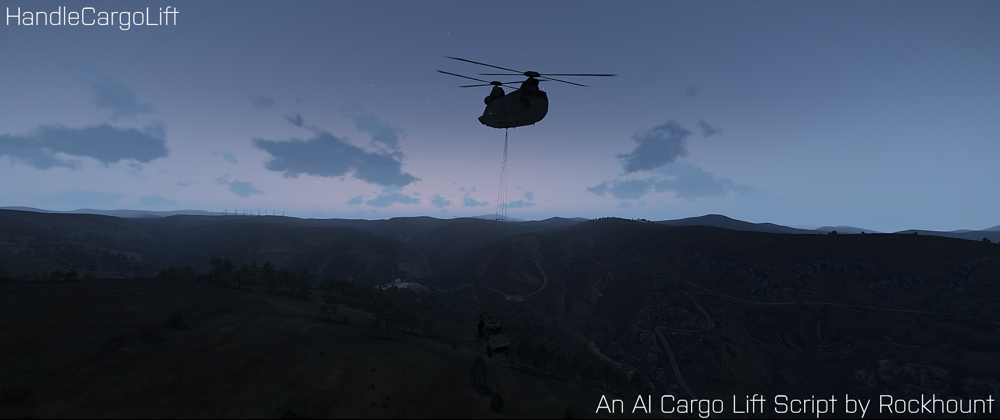

# ArmA 3 Script HandleCargoLift

  

# Support
There will be no official support.

# Pull Requests
Official-Code will remain as it is, but you are free to change it for your purposes.

## Content
It is a single ~250Code-Line-Big Script to let an AI controlled helicopter lift diferrent freight goods to a single destination.

## Purpose
The aim of this script is to make it easier to lift freight goods from A to B without having to have a player pilot.

## Story
A few weeks ago a buddy asked me to write a script for a helicopter to lift and transport cargo, the 'Helikopterfrachttransportskript', that finally provides the desired solution. At first I thought that there would be something out there already. However, according to his research there are no scripts or tutorials that let you have an AI helicopter reliably hovering over a cargo in ArmA 3 (having it meter-precise is imperative). This hovering and the whole process of picking up and setting down the cargo was supposed to look more realistic than just an attachTo. And so this script was written. It provides a precise hovering over the cargo, great looking attachment of the sling rope and picking up of the cargo as well as putting the load down in the same way at the target position. There are several routine integrated to avoid script errors in cases of explosions or deaths of the vehicle or AI. A description can be found inside the SQF file, how to execute the script. Have fun.

## Media

  

### Showcase #1 (Clip)

### Showcase #2 (Clip)

